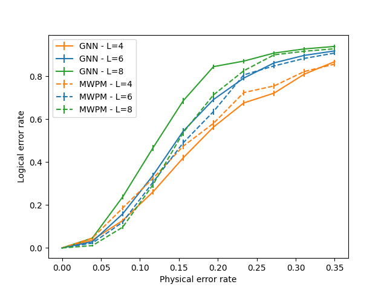

# Decoding Topological Codes with Graph Neural Networks

The project aims to investigate the potential utility of employing Graph Neural Networks (GNNs) to decode the syndrome 
of topological quantum codes. The two most important aspects of QEC Codes decoding algorithms are their efficiency and 
speed, between which there is an inevitable trade-off. In this project, the speed aspect is not considered - the 
algorithm implementations are only prototypical in order to generally illustrate the effectiveness of using GNNs.
It is important to emphasize that the project only implements a high-level decoding GNN model, which predicts errors of 
logical qubits rather than physical qubits.

Topological codes and operations on them were implemented using the qecsim library, see:  
`D. K. Tuckett, Tailoring surface codes: "Improvements in quantum error correction with biased noise",`  
`Ph.D. thesis, University of Sydney (2020), (qecsim: https://github.com/qecsim/qecsim)`

## Environment setup

1. Install Python 3.9 (and cuda11.7 for GPU support)
2. Install poetry: `pip install poetry`
3. Go to project directoryL `cd ../project/path/DTC-GNN`
4. Install poetry environment: `install poetry`
5. If cuda11.7 is installed run:
    - `poetry run poe force-pt-cuda11`
    - `poetry run poe force-dgl-cuda11`

## Project execution

### Data generation

Data generation is one-shot necessity - project pipeline is not adjusted to running multiple experiments with different 
datasets generation parameters, as the data structure in the project is pre-defined and is not subject to research. This 
is also the reason why the data generation process (especially graph syndrome generation) was not implemented in a 
maximally optimal way. 

Data generation configuration: `static_files/config_files/data_generation.yaml`

Data generation run: 
- default parameters: `python static_files/hydra_runs/data_generation.py`
- override example: `python static_files/hydra_runs/data_generation.py ++n_samples=100000 ++split_ratio=0.7`

### GNN model training

Model training configuration: `static_files/config_files/decoder_training_config.yaml`

Model training run: 
- default parameters: `python static_files/hydra_runs/decoder_training.py`
- override example: `python static_files/hydra_runs/decoder_training.py ++data_module.code_dist=6`

### Decoder simulation

The simulation is designed to demonstrate the decoding performance achieved by the GNN decoder at various error levels 
and code distances, compared to a state-of-the-art MWPM decoder. The performance indicator is the logical error rate.

Simulation configuration: `static_files/config_files/decoder_simulation_config.yaml`

Decoder simulation run: 
- default parameters: `python static_files/hydra_runs/decoder_simulation.py`
- override example: `python static_files/hydra_runs/decoder_simulation.py ++num_shots=2000`

An example of GNN performance:

